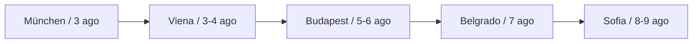

# Viaje München → Sofía — Agosto 2026

**Ruta:** München · Viena · Budapest · Belgrado · Sofía
**Duración:** 7 días (3–9 agosto 2026)
**Viajeros:** 2 personas

---

## Ruta general

---

## Transporte

| Tramo | Medio | Salida | Llegada | Duracion |
|-------|-------|--------|---------|----------|
| München Hbf - Wien Hbf | EC 113 (tren) | 3 ago 08:32 | 3 ago 12:43 | 4h 11m |
| Wien Hbf - Budapest-Keleti | RJ 65 (tren) | 5 ago 09:05 | 5 ago 12:40 | 3h 35m |
| Budapest-Nepliget - Beograd BAS | FlixBus (autobus) | 7 ago 07:30 | 7 ago 15:00 | 7h 30m |
| Beograd - Sofia | Heberg Bus (autobus) | 8 ago 08:00 | 8 ago 14:30 | 6h 30m |

---

## Alojamiento

| Ciudad | Alojamiento | Check-in | Check-out | Precio |
|--------|-------------|----------|-----------|--------|
| Viena | Hotel Metropol Vienna - Florianigasse 39, 1080 Wien | 3 ago 15:00 | 5 ago 11:00 | 210 EUR |
| Budapest | Central Hostel Budapest - Kiraly utca 18, 1061 Budapest | 5 ago 14:00 | 7 ago 10:00 | 95 EUR |
| Belgrado | Green Studio Belgrade - Knez Mihailova 28, 11000 Beograd | 7 ago 16:00 | 8 ago 09:00 | 65 EUR |
| Sofia | Hotel Niky - ul. Neofit Rilski 16, 1000 Sofia | 8 ago 16:00 | 9 ago 12:00 | 88 EUR |

---

## Itinerario diario

### Dia 1 — Domingo 3 ago: München - Viena

**Manana**
- 08:32 Salida desde München Hauptbahnhof, tren EC 113
- 12:43 Llegada a Wien Hauptbahnhof

**Tarde**
- Check-in Hotel Metropol (desde las 15:00)
- Paseo por el Innere Stadt: Stephansplatz, Graben, Kohlmarkt
- Visita al Palacio Hofburg (entrada libre a los patios)

**Noche**
- Cena en el Naschmarkt o en el barrio de Mariahilfer

> **Nota:** Reservar billetes de tren con antelacion en oebb.at — precio estimado 29-49 EUR/persona con Rail & Go.

---

### Dia 2 — Lunes 4 ago: Viena

**Manana**
- Visita al Kunsthistorisches Museum (9:00–18:00, 21 EUR)
- Paseo por los Jardines del Belvedere

**Tarde**
- Palacio Schonbrunn y jardines (entrada exterior gratuita)
- Barrio de Spittelberg: tiendas de artesania y cafes

**Noche**
- Opera Estatal de Viena (entradas de pie desde 3 EUR, venta 80 min antes)

---

### Dia 3 — Martes 5 ago: Viena - Budapest

**Manana**
- 09:05 Salida Wien Hbf, tren RJ 65
- 12:40 Llegada Budapest-Keleti
- Check-in hostal en el distrito VII (barrio judio)

**Tarde**
- Gran Sinagoga de Dohany utca (la mayor de Europa)
- Paseo por el Mercado Central (Nagy Vasarcsarnok)
- Cruce del Puente de las Cadenas a pie

**Noche**
- Barrio de los ruin bars: Szimpla Kert y alrededores

---

### Dia 4 — Miercoles 6 ago: Budapest

**Manana**
- Castillo de Buda y Bastion de los Pescadores (vistas panoramicas)
- Iglesia de Matias

**Tarde**
- Banos termales Szechenyi (entrada 22 EUR, llevar banador)
- Isla Margarita: parque y fuente musical

**Noche**
- Cena en el barrio de Erzsebetvaros

> **Consejo:** Comprar tarjeta Budapest Card 48h (45 EUR) — incluye transporte y descuentos en museos.

---

### Dia 5 — Jueves 7 ago: Budapest - Belgrado

**Manana**
- 07:30 Salida Budapest Nepliget (estacion de autobuses), FlixBus
- 15:00 Llegada Beograd BAS

**Tarde**
- Check-in Green Studio
- Fortaleza de Kalemegdan y confluencia de los rios Sava y Danubio
- Calle Knez Mihailova (peatonal)

**Noche**
- Barrio de Skadarlija: restaurantes tradicionales serbios (pljeskavica, cevapi)

---

### Dia 6 — Viernes 8 ago: Belgrado - Sofia

**Manana**
- 08:00 Salida Belgrado, Heberg Bus directo a Sofia
- 14:30 Llegada Sofia

**Tarde**
- Check-in Hotel Niky
- Iglesia de Alexander Nevsky (entrada libre)
- Antiguo Mercado de los Ladrones (Zhenski Pazar)

**Noche**
- Barrio de Vitosha Boulevard: bares y restaurantes

---

### Dia 7 — Sabado 9 ago: Sofia

**Manana**
- Monasterio de Boyana (Patrimonio UNESCO, a 8 km del centro — taxi 15 BGN)
- Museo Nacional de Historia de Bulgaria

**Tarde**
- Rotonda de San Jorge (siglo IV, en el centro)
- Parque Borisova Gradina: descanso antes de vuelo o tren de regreso
- Check-out Hotel Niky (hasta las 12:00)

> **Vuelo de regreso:** Sofia (SOF) - München (MUC) con Lufthansa / Eurowings — duración aprox. 2h 10m. Reservar con antelacion (precio orientativo 80-140 EUR).

---

## Presupuesto estimado

| Concepto | Importe (2 pax) |
|----------|-----------------|
| Transporte München - Viena (tren) | 70 EUR |
| Transporte Viena - Budapest (tren) | 60 EUR |
| Transporte Budapest - Belgrado (bus) | 50 EUR |
| Transporte Belgrado - Sofia (bus) | 40 EUR |
| Vuelo Sofia - München | 200 EUR |
| Alojamiento (7 noches total) | 458 EUR |
| Comidas y actividades | 400 EUR |
| **Total estimado** | **~1.278 EUR** |

---

## Informacion util

| | |
|---|---|
| **Monedas** | EUR (Austria, Eslovenia), HUF (Hungria), RSD (Serbia), BGN (Bulgaria) |
| **Visados** | No necesarios (UE / Schengen) |
| **Idioma** | Aleman / Hungaro / Serbio / Bulgaro — ingles ampliamente hablado en centros turisticos |
| **Enchufes** | Tipo F (Schuko) en todos los paises |
| **Emergencias** | 112 en toda Europa |
| **App recomendada** | Bolt (taxi), Google Maps (transporte publico), Revolut (cambio de moneda) |
