# Eurotrip München → Sofía — Agosto 2026

**Duración:** 31 días, del 1 al 31 de agosto de 2026; 30 noches.
**Viajeros:** 2 personas.
**Países:** Alemania, Austria, Eslovaquia, Chequia, Hungría, Rumanía y Bulgaria.
**Inicio:** München. **Final:** Sofía, sin regreso incluido.
**Condición:** sin visitas ni tránsito por Serbia; entrada a Bulgaria por Rumanía y el corredor Giurgiu–Ruse.

> Propuesta de viaje, sin reservas confirmadas. Se conserva agosto de 2026 del original y se amplía al mes completo. Los bloques de transporte y presupuestos son objetivos de planificación, no horarios ni precios confirmados.

---

## Ruta general con retornos

München → Linz → Viena → Bratislava → Viena → Brno → Praga → Brno → Bratislava → Budapest → Bratislava → Budapest → Brașov → Bucarest → Ruse → Veliko Tarnovo → Sofía → Plovdiv → Sofía.

Las visitas repetidas tienen objetivos diferentes: Viena pasa del paseo urbano a los museos; Bratislava combina casco antiguo, excursión y descanso; Budapest separa Pest, Buda y la preparación del nocturno. Sofía abre y cierra el circuito búlgaro.

```mermaid
graph LR
  M["Munchen / 1 ago"] -->|"2 ago"| L["Linz / 2-3 ago"]
  L -->|"4 ago"| V["Viena / 4-6, 7-8 ago"]
  V -->|"7 ago"| B["Bratislava / 7, 14-15 y 19 ago"]
  B -->|"8 ago"| V
  V -->|"9 ago"| N["Brno / 9 y 13 ago"]
  N -->|"10 ago"| P["Praga / 10-12 ago"]
  P -->|"13 ago"| N
  N -->|"14 ago"| B
  B -->|"16 y 20 ago"| U["Budapest / 16-18 y 20-21 ago"]
  U -->|"19 ago"| B
  U -->|"Nocturno / 21-22 ago"| R["Brasov / 22-23 ago"]
  R -->|"24 ago"| C["Bucarest / 24-25 ago"]
  C -->|"26 ago / via Giurgiu"| D["Ruse / 26 ago"]
  D -->|"27 ago"| T["Veliko Tarnovo / 27 ago"]
  T -->|"28 ago"| S["Sofia / 28 y 31 ago"]
  S -->|"29 ago"| Pl["Plovdiv / 29-30 ago"]
  Pl -->|"31 ago"| S
```

Un único mapa reúne todo el mes. Cada ciudad aparece una vez; las fechas de las flechas indican el orden de los desplazamientos y los regresos. El diagrama se reduce proporcionalmente para caber completo en el área imprimible del PDF.

---

## Itinerario diario

Las visitas interiores quedan sujetas a apertura y entradas disponibles. En días de traslado, reservar la mañana principalmente al transporte y evitar entradas con hora fija inmediatamente después de llegar.

### Semana 1 — Alpes y primer retorno

| Día y fecha | Mañana | Tarde y noche | Dormir en |
|-------------|--------|---------------|-----------|
| 1 · sáb 1 ago | Inicio en München y Marienplatz. | Viktualienmarkt y Englischer Garten. | München |
| 2 · dom 2 ago | Viaje directo a Linz desde München. | Paseo por la ciudad, casco antiguo y Danubio. | Linz |
| 3 · lun 3 ago | Linz: casco antiguo y orilla del Danubio. | Ars Electronica Center o Pöstlingberg. | Linz |
| 4 · mar 4 ago | Tren a Viena y dejar equipaje. | Stephansplatz, Graben y patios del Hofburg. | Viena I |
| 5 · mié 5 ago | Museos: Kunsthistorisches o Belvedere. | Spittelberg y cafés. | Viena I |
| 6 · jue 6 ago | Schönbrunn: elegir palacio o jardines. | Paseo y descanso. | Viena I |
| 7 · vie 7 ago | Viena → Bratislava. | Casco antiguo y paseo hacia el castillo. | Bratislava I |
### Semana 2 — Chequia y Bratislava otra vez

| Día y fecha | Mañana | Tarde y noche | Dormir en |
|-------------|--------|---------------|-----------|
| 8 · sáb 8 ago | Viena → Brno. | Plaza de la Libertad y paseo por Špilberk. | Brno I |
| 9 · dom 9 ago | Brno → Praga. | Ciudad Vieja y ribera del Moldava. | Praga |
| 10 · lun 10 ago | Puente de Carlos temprano y Malá Strana. | Recinto del Castillo de Praga. | Praga |
| 11 · mar 11 ago | Vyšehrad y paseo por el río. | Lavandería, cafés y medio día libre. | Praga |
| 12 · mié 12 ago | Praga → Brno. | Arquitectura y parques; Villa Tugendhat solo con reserva disponible. | Brno II |
| 13 · jue 13 ago | Brno → Bratislava. | Ribera del Danubio y calles fuera del primer recorrido. | Bratislava II |
| 14 · vie 14 ago | Excursión local a Devín, con transporte por confirmar. | Regreso a Bratislava y descanso. | Bratislava II |

### Semana 3 — Budapest, otro zigzag y Rumanía

| Día y fecha | Mañana | Tarde y noche | Dormir en |
|-------------|--------|---------------|-----------|
| 15 · sáb 15 ago | Bratislava → Budapest. | Pest y barrio de Erzsébetváros. | Budapest I |
| 16 · dom 16 ago | Buda: barrio del castillo y miradores. | Danubio e isla Margarita. | Budapest I |
| 17 · lun 17 ago | Baños termales, con entrada por comprobar. | Parque de la Ciudad y cena tranquila. | Budapest I |
| 18 · mar 18 ago | Budapest → Bratislava: vuelta al oeste. | Repetir el lugar favorito o descansar toda la tarde. | Bratislava III |
| 19 · mié 19 ago | Bratislava → Budapest otra vez. | Llegada tranquila y provisiones para el tramo rumano. | Budapest II |
| 20 · jue 20 ago | Budapest sin agenda rígida; equipaje en consigna. | Tren nocturno hacia Brașov, sujeto a servicio y reserva de litera. | Tren nocturno |
| 21 · vie 21 ago | Llegada a Brașov y descanso. | Piața Sfatului y casco antiguo; sin excursiones largas. | Brașov |

### Últimos diez días — Rumanía y Bulgaria

| Día y fecha | Mañana | Tarde y noche | Dormir en |
|-------------|--------|---------------|-----------|
| 22 · sáb 22 ago | Brașov y entorno de Tâmpa según clima y energía. | Visita cultural opcional y descanso. | Brașov |
| 23 · dom 23 ago | Brașov → Bucarest. | Llegada al alojamiento y paseo corto. | Bucarest |
| 24 · lun 24 ago | Calea Victoriei y parques. | Museo según apertura y preparar el cruce internacional. | Bucarest |
| 25 · mar 25 ago | Bucarest → Ruse por Giurgiu; dejar margen para el viaje. | Centro de Ruse y ribera si la llegada lo permite. | Ruse |
| 26 · mié 26 ago | Ruse → Veliko Tarnovo. | Casco antiguo y miradores; Tsarevets si queda tiempo. | Veliko Tarnovo |
| 27 · jue 27 ago | Veliko Tarnovo → Sofía; día principalmente de transporte. | Primera visita breve: Alexander Nevsky y centro. | Sofía I |
| 28 · vie 28 ago | Sofía → Plovdiv: desvío al este. | Kapana y casco antiguo. | Plovdiv |
| 29 · sáb 29 ago | Calles históricas y teatro romano si se visita. | Tarde libre y cena sin prisas. | Plovdiv |
| 30 · dom 30 ago | Plovdiv → Sofía: último regreso. | Rotonda de San Jorge, Vitosha Boulevard y cena de cierre. | Sofía II |
| 31 · lun 31 ago | Desayuno tranquilo y último paseo. | Recoger equipaje y finalizar el eurotrip en Sofía. | Sin noche incluida |

---

## Transporte

Los bloques indican **tiempo reservado en la agenda**, incluyendo accesos, esperas y enlaces. No son duraciones publicadas ni garantizan conexiones directas.

| Fecha | Tramo | Medio previsto | Bloque de agenda |
|-------|-------|----------------|------------------|
| 2 ago | München → Linz | Tren | Media jornada |
| 4 ago | Linz → Viena | Tren | Media jornada |
| 6 y 7 ago | Viena → Bratislava → Viena | Tren, un tramo cada día | Mañana de cada día |
| 8 ago | Viena → Brno | Tren | Media jornada |
| 9 y 12 ago | Brno → Praga → Brno | Tren, en fechas separadas | Media jornada por tramo |
| 13 ago | Brno → Bratislava | Tren | Media jornada |
| 15, 18 y 19 ago | Bratislava → Budapest → Bratislava → Budapest | Tren, un tramo por fecha | Media jornada por tramo |
| 20–21 ago | Budapest → Brașov | Tren nocturno, reservar cama o litera | Noche del 20 y mañana del 21 |
| 23 ago | Brașov → Bucarest | Tren | Media jornada con margen |
| 25 ago | Bucarest → Ruse vía Giurgiu | Tren internacional o autobús de recorrido verificado | Jornada libre hasta llegar |
| 26 ago | Ruse → Veliko Tarnovo | Tren con posibles enlaces o autobús | Media jornada amplia |
| 27 ago | Veliko Tarnovo → Sofía | Tren con posibles enlaces o autobús | Gran parte del día |
| 28 y 30 ago | Sofía → Plovdiv → Sofía | Tren o autobús, en fechas separadas | Media jornada por tramo |

ÖBB publica conexiones hacia Bratislava. MÁV incluye Brașov entre las paradas del Dacia nocturno entre Budapest y Bucarest. BDZ publica el corredor Bucarest–Sofía con paso por Ruse. Estas referencias respaldan la ruta, pero no confirman disponibilidad para cada fecha; fuentes al final.

**Sin Serbia también en los billetes:** conservar Budapest → Rumanía → Giurgiu → Ruse → Bulgaria. Revisar países y estaciones de cualquier alternativa antes de comprar; no aceptar sustituciones vía Belgrado.

**Si no hay litera:** dedicar el día 20 a una conexión diurna confirmada por Rumanía y dormir en ruta o en Brașov. Sustituir la noche de tren sin añadir días; actualizar alojamiento y reducir las visitas del 21 si hace falta.

**Si cambia Bucarest–Ruse:** elegir una alternativa confirmada vía Giurgiu/Ruse y mantener la noche en Ruse como margen. Evitar otro traslado largo ese día.

---

## Alojamiento — 29 noches en tierra y 1 en tren

Habitación para dos personas; hoteles y disponibilidad por elegir. Cada regreso requiere una reserva separada, aunque se repita establecimiento.

| Base | Entrada | Salida | Noches |
|------|---------|--------|--------|
| München | 1 ago | 2 ago | 1 |
| Linz | 2 ago | 4 ago | 2 |
| Viena I | 4 ago | 6 ago | 2 |
| Bratislava I | 6 ago | 7 ago | 1 |
| Viena II | 7 ago | 8 ago | 1 |
| Brno I | 8 ago | 9 ago | 1 |
| Praga | 9 ago | 12 ago | 3 |
| Brno II | 12 ago | 13 ago | 1 |
| Bratislava II | 13 ago | 15 ago | 2 |
| Budapest I | 15 ago | 18 ago | 3 |
| Bratislava III | 18 ago | 19 ago | 1 |
| Budapest II | 19 ago | 20 ago | 1 |
| Tren nocturno | 20 ago | 21 ago | 1 |
| Brașov | 21 ago | 23 ago | 2 |
| Bucarest | 23 ago | 25 ago | 2 |
| Ruse | 25 ago | 26 ago | 1 |
| Veliko Tarnovo | 26 ago | 27 ago | 1 |
| Sofía I | 27 ago | 28 ago | 1 |
| Plovdiv | 28 ago | 30 ago | 2 |
| Sofía II | 30 ago | 31 ago | 1 |
| **Total** | **1 ago** | **31 ago** | **30** |

Priorizar acceso sencillo a la estación en estancias de una noche. Tras el nocturno no se presupone acceso temprano a la habitación.

---

## Presupuesto de planificación — 2 personas

Objetivos de gasto, **no cotizaciones**. Los retornos añaden billetes y cambios de alojamiento y forman parte del presupuesto.

| Concepto | Cálculo orientativo | Total para 2 |
|----------|---------------------|--------------|
| Alojamiento en tierra | 29 noches × 70–120 EUR por habitación | 2.030–3.480 EUR |
| Transporte entre ciudades | Tramos diurnos y 2 plazas nocturnas | 900–1.500 EUR |
| Transporte urbano y excursión local | Bolsa mensual | 180–300 EUR |
| Comidas | 31 días × 45–70 EUR entre ambos | 1.395–2.170 EUR |
| Museos, termas y visitas | Bolsa mensual | 250–450 EUR |
| **Subtotal** | | **4.755–7.900 EUR** |
| Imprevistos | 15 % del subtotal, redondeado | 713–1.185 EUR |
| **Total objetivo** | | **5.468–9.085 EUR** |

La litera se cuenta en transporte, no en alojamiento. No se incluyen el desplazamiento inicial hasta München, el regreso desde Sofía, compras personales ni seguro. Si se sustituye el nocturno, recalcular esa noche y los billetes.

---

## Organización práctica

- **Equipaje ligero:** numerosas estancias duran una noche; conviene poder caminar y subir al tren con todo el equipaje.
- **Calendario:** distinguir Viena I/II, Bratislava I/II/III, Budapest I/II y Sofía I/II al guardar reservas.
- **Descanso:** Praga el 11, Bratislava el 14 y el 18, Brașov el 21 y Plovdiv el 29 permiten bajar el ritmo.
- **Horas locales:** copiar las horas de cada billete y comprobar el huso horario al calcular enlaces internacionales.
- **Documentación:** comprobar requisitos según la nacionalidad y documentación de ambos viajeros.
- **Reservas:** confirmar primero la litera y el cruce Bucarest–Ruse; después coordinar las estancias.
- **Final:** cualquier vuelo o continuación desde Sofía se reserva aparte; ajustar las visitas del 31 si se sale ese día.

## Fuentes para comprobar conexiones

Referencias oficiales consultadas el 5 de septiembre de 2026. La consulta es posterior al mes conservado: identifica operadores y corredores, pero no certifica retrospectivamente los horarios de agosto.

- [ÖBB — conexiones hacia Eslovaquia](https://www.oebb.at/de/tickets-kundenkarten/oesterreich-europa/sparschiene/sparschiene-europa/slowakei): Viena–Bratislava.
- [MÁV — rutas nocturnas](https://www.mavcsoport.hu/en/mav-szemelyszallitas/international-travels/travel-night-trains): Dacia y paradas rumanas, incluida Brașov.
- [BDZ — Sofía–Bucarest y Varna–Bucarest](https://www.bdz.bg/bg/a/sofiya-bukureshch-sofiya): corredor entre Rumanía y Bulgaria.
- [BDZ — billetes internacionales](https://www.bdz.bg/en/a/office-for-international-rail-tickets): venta y reservas.
