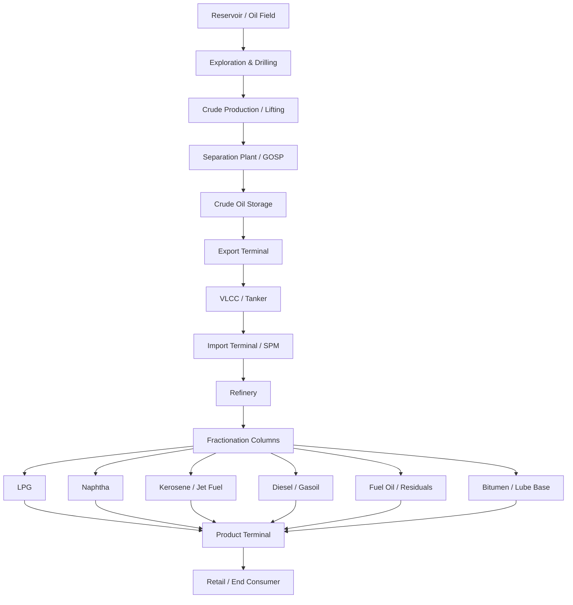
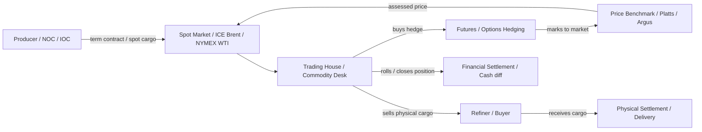
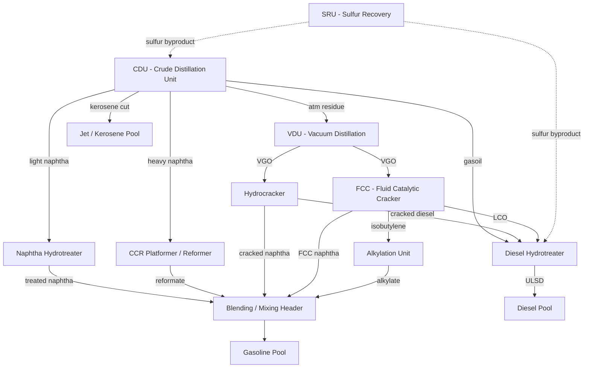
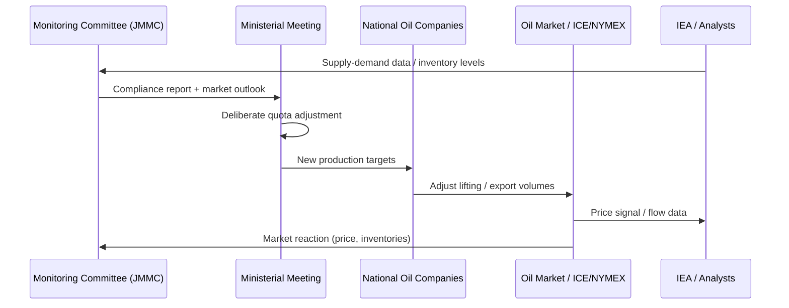
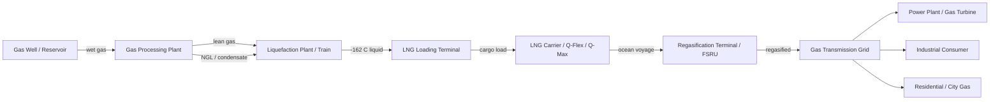
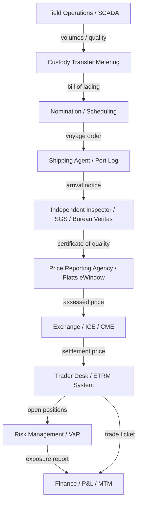

# Oil Industry — Flows & Market Dynamics

A visual reference for the main physical and commercial flows in the global oil industry,
from upstream extraction to end-consumer products and financial markets.

---

## 1. Upstream to Downstream — Physical supply chain

---

## 2. Crude oil pricing & trading flow

---

## 3. Refinery internal flows — Conversion units

---

## 4. OPEC+ production decision cycle

---

## 5. LNG value chain — Gas to market

---

## 6. Oil market information flow — From wellhead to price

